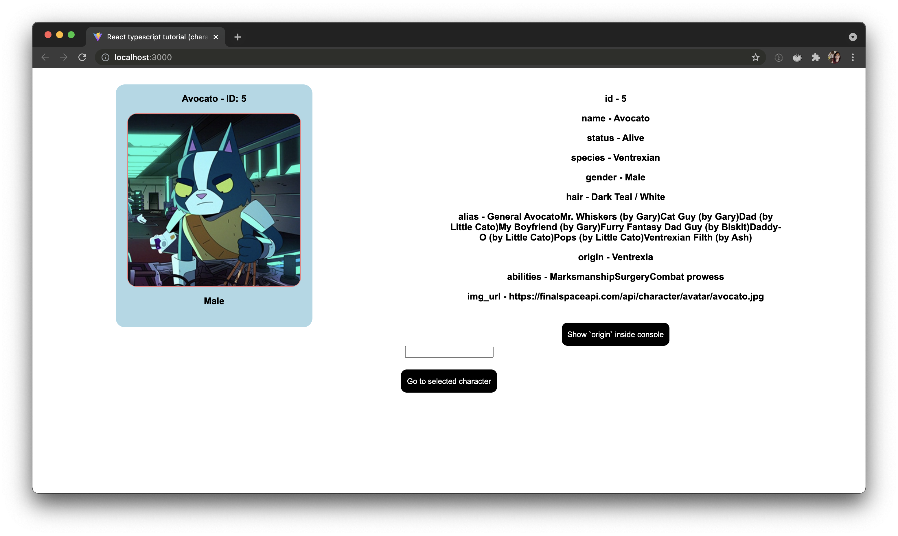

# React TypeScript tutorial

TypeScript basic tutorial

| \                | \                                                                                                                                                  |
| ---------------- | -------------------------------------------------------------------------------------------------------------------------------------------------- |
| Deploy status    | /                                                                                                                                                  |
| Deploy preview   | /                                                                                                                                                  |
| Project typology | 📒 Step by step from tutorial [React with Typescript Week - Weibenfalk](https://www.youtube.com/watch?v=iNO_bq7GMhQ&list=PL0jpcQ5lO0nFRb4ecmZWr6wiW9zQ0Rv2j&ab_channel=Weibenfalk) |



## 🔥 Tech stack

| Purpose    | Technology    |
| :--------- | :------------ |
| Scaffoling | Vite + ESLint |
| Templating | TS            |

## 🌊 Run development mode

```shell
npm start
```

## 🧳 Build setup

Not available

## 🌿 Branches

| Branch name | Use        |
| :---------- | :--------- |
| `main`      | production |
